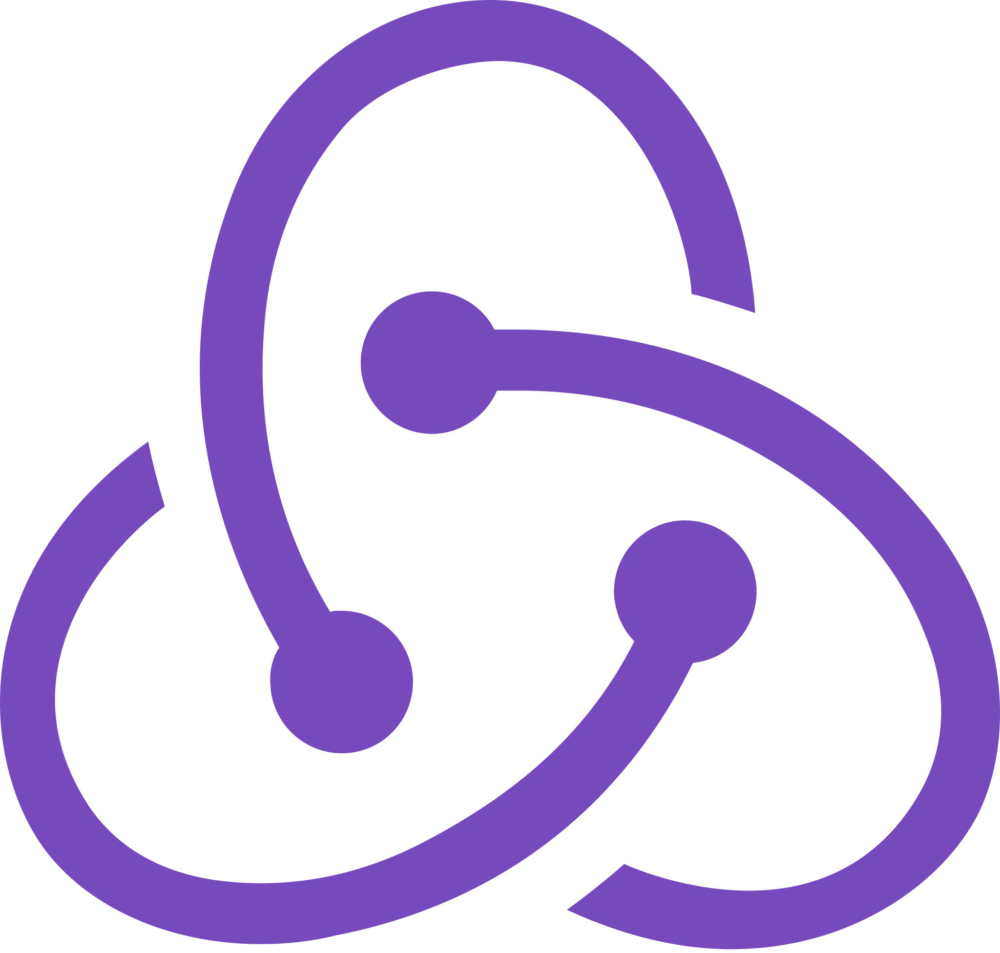

## Hi there 👋

- I am Software Engineer from Nepal
- 📃 About me
- I am full stack developer, I love to do things from start to finish.
- 📫 How to reach me: bpngaire@gmail.com

📝 Working on..

- 🔭 I’m currently working with Django, Vue, Nuxt, React, Next

🛠 Things I work with

<!-- - 🔗  -->
<!--
**bpn21/bpn21** is a ✨ _special_ ✨ repository because its `README.md` (this file) appears on your GitHub profile.

Here are some ideas to get you started:

- 🔭 I’m currently working on ...
- 🌱 I’m currently learning ...
- 👯 I’m looking to collaborate on ...
- 🤔 I’m looking for help with ...
- 💬 Ask me about ...
- 📫 How to reach me: ...
- 😄 Pronouns: ...
- ⚡ Fun fact: ...
  -->

<!--  -->

</p
